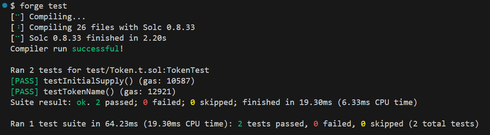
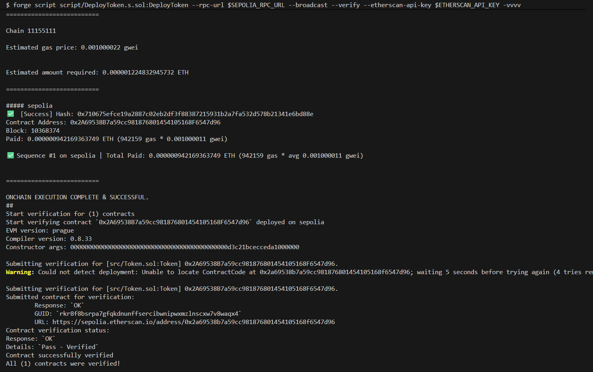

# ShamuNeko Token (SHNK)

A simple ERC-20 token built with Solidity and Foundry, using OpenZeppelin contracts.

## Token Details

- **Name:** ShamuNeko
- **Symbol:** SHNK
- **Total Supply:** 1,000,000 SHNK
- **Network:** Ethereum Sepolia Testnet
- **Contract Address:** `0x2A69538B7a59cc981876801454105168F6547d96`

## Deployment

The token is deployed on Sepolia testnet and verified on Etherscan:

🔗 [View on Sepolia Etherscan](https://sepolia.etherscan.io/address/0x2A69538B7a59cc981876801454105168F6547d96#code)

## Built With

- [Solidity](https://soliditylang.org/) - Smart contract programming language
- [Foundry](https://book.getfoundry.sh/) - Ethereum development toolkit
- [OpenZeppelin](https://www.openzeppelin.com/contracts) - Secure smart contract library

## Project Structure

```
├── src/
│   └── Token.sol          # ERC-20 token contract
├── test/
│   └── Token.t.sol        # Test suite
├── script/
│   └── DeployToken.s.sol  # Deployment script
├── cli_pictures/          # CLI screenshots
├── broadcast/             # receipts of your deployments
├── .gitignore
├── .gitmodules
├── LICENSE.md
├── README.md
├── foundry.lock
└── foundry.toml
```

## Getting Started

### Prerequisites

- [Foundry](https://book.getfoundry.sh/getting-started/installation)

### Installation

```bash
git clone https://github.com/04arush/ERC-20-Token-SHNK.git
cd ERC-20-Token-SHNK
forge install
```

### Build

```bash
forge build
```

### Test

```bash
forge test
```



### Deploy

1. Create a `.env` file with your private key:
```
PRIVATE_KEY=your_private_key_here
SEPOLIA_RPC_URL=your_sepolia_rpc_url
```

2. Deploy to Sepolia:
```bash
forge script script/DeployToken.s.sol:DeployToken --rpc-url $SEPOLIA_RPC_URL --broadcast --verify
```



## Contract Features

- Standard ERC-20 implementation
- Initial supply minted to deployer
- Built on OpenZeppelin's audited contracts

## License

This project is licensed under the MIT License - see the [LICENSE.md](LICENSE.md) file for details.
